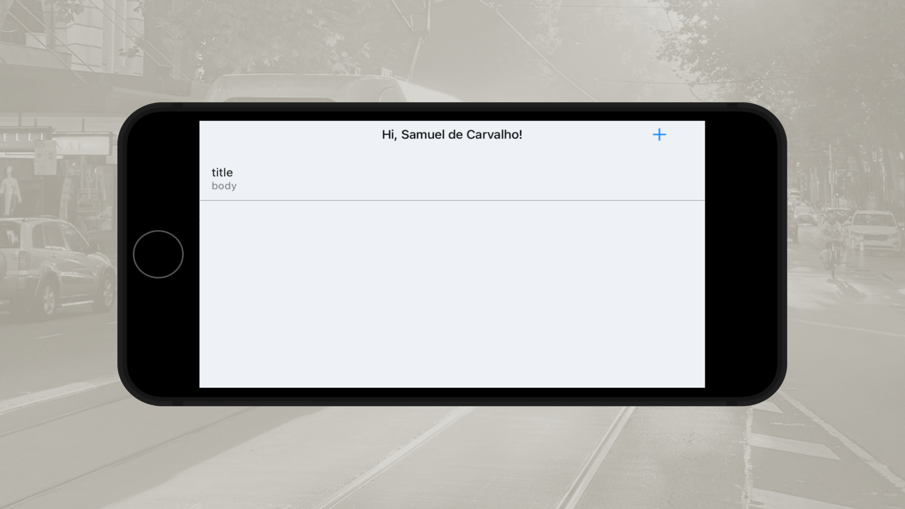

<h1 align="center">
Notes App With SwiftUI, Apple Human Design Guideline, SwiftData, View Inspector, VIPER Architecture
</h1>

 

 

  <a href="#description">✍️ Description</a> &nbsp;&nbsp;&nbsp;|&nbsp;&nbsp;&nbsp <a href="#technologies">🚀 Technologies</a>

 
 

<h3 id="description">✍️ Description:</h3>

This project was designed to explore modern iOS development practices by combining SwiftUI's declarative UI paradigm with the VIPER architectural pattern. The main goal was to achieve a highly modular, scalable, and testable application structure, where each layer has a well-defined responsibility. Following Apple's Human Interface Guidelines ensures a consistent and accessible user experience, while SwiftData provides a native persistence solution integrated with the Swift ecosystem. Additionally, ViewInspector is leveraged to validate SwiftUI components through unit testing, increasing confidence in UI behavior and application stability.

 

<h3 id="technologies">🚀 Technologies:</h3>

To build this project is used:

- SwiftUI
- Swift
- Swift Format
- Xcode
- View Inspector
- SwiftData
- Foundation Framework
- Alamofire
- Apple Human Design Guideline
